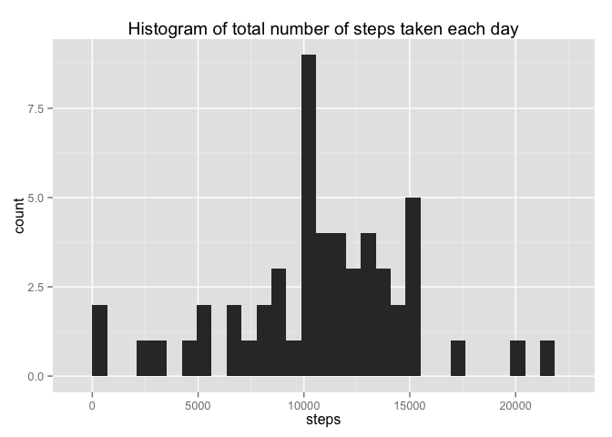
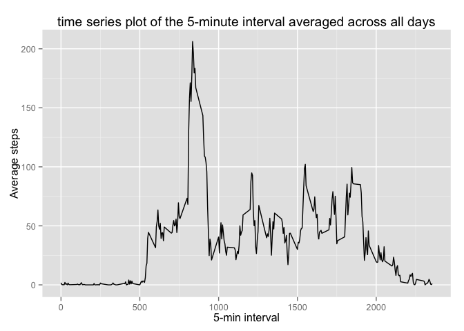
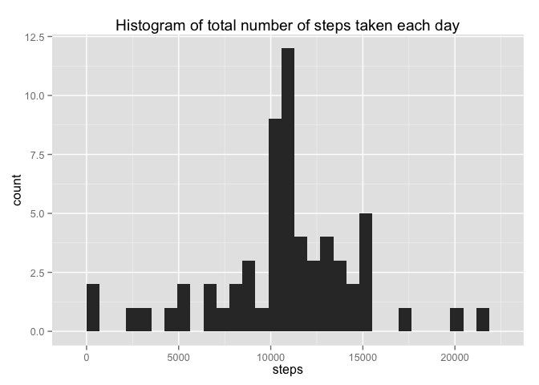
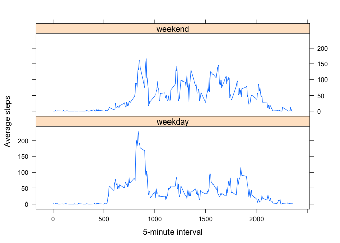

# Reproducible Research: Peer Assessment 1


## Loading and preprocessing the data

```r
# setwd("~/Google Drive/GitHub/RepData_PeerAssessment1")
# setwd("C:/Users/Ben/Google Drive/GitHub/RepData_PeerAssessment1")
# setwd("C:/Users/Harry Samsung Laptop/Downloads/ben.liu's work/GitHub/RepData_PeerAssessment1")

unzip("activity.zip")
# list.files()
data=read.csv("activity.csv",colClass=c("integer","Date","factor"))

library(ggplot2)
library(lattice)
```

## What is mean total number of steps taken per day?
### histogram of the total number of steps taken each day

```r
# remove NA in steps column
df=data[!is.na(data$steps),]

dailysum=aggregate(steps~date,data=df,sum)
qplot(steps, data=dailysum,main = "Histogram of total number of steps taken each day")
```

```
## stat_bin: binwidth defaulted to range/30. Use 'binwidth = x' to adjust this.
```

 

### the mean total number of steps taken per day

```r
dailymean=aggregate(steps~date,data=df,mean)
dailymean
```

```
##          date      steps
## 1  2012-10-02  0.4375000
## 2  2012-10-03 39.4166667
## 3  2012-10-04 42.0694444
## 4  2012-10-05 46.1597222
## 5  2012-10-06 53.5416667
## 6  2012-10-07 38.2465278
## 7  2012-10-09 44.4826389
## 8  2012-10-10 34.3750000
## 9  2012-10-11 35.7777778
## 10 2012-10-12 60.3541667
## 11 2012-10-13 43.1458333
## 12 2012-10-14 52.4236111
## 13 2012-10-15 35.2048611
## 14 2012-10-16 52.3750000
## 15 2012-10-17 46.7083333
## 16 2012-10-18 34.9166667
## 17 2012-10-19 41.0729167
## 18 2012-10-20 36.0937500
## 19 2012-10-21 30.6284722
## 20 2012-10-22 46.7361111
## 21 2012-10-23 30.9652778
## 22 2012-10-24 29.0104167
## 23 2012-10-25  8.6527778
## 24 2012-10-26 23.5347222
## 25 2012-10-27 35.1354167
## 26 2012-10-28 39.7847222
## 27 2012-10-29 17.4236111
## 28 2012-10-30 34.0937500
## 29 2012-10-31 53.5208333
## 30 2012-11-02 36.8055556
## 31 2012-11-03 36.7048611
## 32 2012-11-05 36.2465278
## 33 2012-11-06 28.9375000
## 34 2012-11-07 44.7326389
## 35 2012-11-08 11.1770833
## 36 2012-11-11 43.7777778
## 37 2012-11-12 37.3784722
## 38 2012-11-13 25.4722222
## 39 2012-11-15  0.1423611
## 40 2012-11-16 18.8923611
## 41 2012-11-17 49.7881944
## 42 2012-11-18 52.4652778
## 43 2012-11-19 30.6979167
## 44 2012-11-20 15.5277778
## 45 2012-11-21 44.3993056
## 46 2012-11-22 70.9270833
## 47 2012-11-23 73.5902778
## 48 2012-11-24 50.2708333
## 49 2012-11-25 41.0902778
## 50 2012-11-26 38.7569444
## 51 2012-11-27 47.3819444
## 52 2012-11-28 35.3576389
## 53 2012-11-29 24.4687500
```

### the median total number of steps taken per day

```r
dailymedian=aggregate(steps~date,data=df,median)
dailymedian
```

```
##          date steps
## 1  2012-10-02     0
## 2  2012-10-03     0
## 3  2012-10-04     0
## 4  2012-10-05     0
## 5  2012-10-06     0
## 6  2012-10-07     0
## 7  2012-10-09     0
## 8  2012-10-10     0
## 9  2012-10-11     0
## 10 2012-10-12     0
## 11 2012-10-13     0
## 12 2012-10-14     0
## 13 2012-10-15     0
## 14 2012-10-16     0
## 15 2012-10-17     0
## 16 2012-10-18     0
## 17 2012-10-19     0
## 18 2012-10-20     0
## 19 2012-10-21     0
## 20 2012-10-22     0
## 21 2012-10-23     0
## 22 2012-10-24     0
## 23 2012-10-25     0
## 24 2012-10-26     0
## 25 2012-10-27     0
## 26 2012-10-28     0
## 27 2012-10-29     0
## 28 2012-10-30     0
## 29 2012-10-31     0
## 30 2012-11-02     0
## 31 2012-11-03     0
## 32 2012-11-05     0
## 33 2012-11-06     0
## 34 2012-11-07     0
## 35 2012-11-08     0
## 36 2012-11-11     0
## 37 2012-11-12     0
## 38 2012-11-13     0
## 39 2012-11-15     0
## 40 2012-11-16     0
## 41 2012-11-17     0
## 42 2012-11-18     0
## 43 2012-11-19     0
## 44 2012-11-20     0
## 45 2012-11-21     0
## 46 2012-11-22     0
## 47 2012-11-23     0
## 48 2012-11-24     0
## 49 2012-11-25     0
## 50 2012-11-26     0
## 51 2012-11-27     0
## 52 2012-11-28     0
## 53 2012-11-29     0
```

## What is the average daily activity pattern?
### time series plot of the 5-minute interval averaged across all days

```r
# allocate order number for intervals; 17568/288=61
# data$int=rep(1:288,61)
data$interval=as.numeric(as.character(data$interval))

# aggregate steps with same interval/time of the day; NA will be removed
fivemin=aggregate(steps~interval,data=data,mean,na.rm=TRUE)

# total number of steps taken each day
ggplot(fivemin,aes(x=interval,y=steps))+ geom_line() + ggtitle("time series plot of the 5-minute interval averaged across all days") + labs(x="5-min interval",y="Average steps") 
```

 

### Which 5-minute interval, on average across all the days in the dataset, contains the maximum number of steps?
The 5-minute interval containing the maximum number of steps is:

```r
fivemin$interval[fivemin$steps %in% max(fivemin$steps)]
```

```
## [1] 835
```


## Imputing missing values
### Calculate and report the total number of missing values in the dataset
Total number of missing values is:

```r
nrow(data[is.na(data$steps),])
```

```
## [1] 2304
```

### Devise a strategy for filling in all of the missing values in the dataset
Use average (mean) 5-minute interval to fill in missing values.

### Create a new dataset with the missing data filled in

```r
df1=data[!is.na(data$steps),]
df2=data[is.na(data$steps),]
for(i in 1:nrow(df2)){
  df2$steps[i]=fivemin$steps[fivemin$interval %in% df2$interval[i]]
}

# create new dataset
newdata=rbind(df1,df2)

# rm(df1,df2)
```

### Make a histogram of the total number of steps taken each day

```r
dailysumnew=aggregate(steps~date,data=newdata,sum)
qplot(steps, data=dailysumnew,main = "Histogram of total number of steps taken each day")
```

```
## stat_bin: binwidth defaulted to range/30. Use 'binwidth = x' to adjust this.
```

 

### Calculate and report the mean and median total number of steps taken per day. 

#### new mean total number of steps taken per day

```r
dailymeannew=aggregate(steps~date,data=newdata,mean)
dailymeannew
```

```
##          date      steps
## 1  2012-10-01 37.3825996
## 2  2012-10-02  0.4375000
## 3  2012-10-03 39.4166667
## 4  2012-10-04 42.0694444
## 5  2012-10-05 46.1597222
## 6  2012-10-06 53.5416667
## 7  2012-10-07 38.2465278
## 8  2012-10-08 37.3825996
## 9  2012-10-09 44.4826389
## 10 2012-10-10 34.3750000
## 11 2012-10-11 35.7777778
## 12 2012-10-12 60.3541667
## 13 2012-10-13 43.1458333
## 14 2012-10-14 52.4236111
## 15 2012-10-15 35.2048611
## 16 2012-10-16 52.3750000
## 17 2012-10-17 46.7083333
## 18 2012-10-18 34.9166667
## 19 2012-10-19 41.0729167
## 20 2012-10-20 36.0937500
## 21 2012-10-21 30.6284722
## 22 2012-10-22 46.7361111
## 23 2012-10-23 30.9652778
## 24 2012-10-24 29.0104167
## 25 2012-10-25  8.6527778
## 26 2012-10-26 23.5347222
## 27 2012-10-27 35.1354167
## 28 2012-10-28 39.7847222
## 29 2012-10-29 17.4236111
## 30 2012-10-30 34.0937500
## 31 2012-10-31 53.5208333
## 32 2012-11-01 37.3825996
## 33 2012-11-02 36.8055556
## 34 2012-11-03 36.7048611
## 35 2012-11-04 37.3825996
## 36 2012-11-05 36.2465278
## 37 2012-11-06 28.9375000
## 38 2012-11-07 44.7326389
## 39 2012-11-08 11.1770833
## 40 2012-11-09 37.3825996
## 41 2012-11-10 37.3825996
## 42 2012-11-11 43.7777778
## 43 2012-11-12 37.3784722
## 44 2012-11-13 25.4722222
## 45 2012-11-14 37.3825996
## 46 2012-11-15  0.1423611
## 47 2012-11-16 18.8923611
## 48 2012-11-17 49.7881944
## 49 2012-11-18 52.4652778
## 50 2012-11-19 30.6979167
## 51 2012-11-20 15.5277778
## 52 2012-11-21 44.3993056
## 53 2012-11-22 70.9270833
## 54 2012-11-23 73.5902778
## 55 2012-11-24 50.2708333
## 56 2012-11-25 41.0902778
## 57 2012-11-26 38.7569444
## 58 2012-11-27 47.3819444
## 59 2012-11-28 35.3576389
## 60 2012-11-29 24.4687500
## 61 2012-11-30 37.3825996
```

#### new median total number of steps taken per day

```r
dailymediannew=aggregate(steps~date,data=newdata,median)
dailymediannew
```

```
##          date    steps
## 1  2012-10-01 34.11321
## 2  2012-10-02  0.00000
## 3  2012-10-03  0.00000
## 4  2012-10-04  0.00000
## 5  2012-10-05  0.00000
## 6  2012-10-06  0.00000
## 7  2012-10-07  0.00000
## 8  2012-10-08 34.11321
## 9  2012-10-09  0.00000
## 10 2012-10-10  0.00000
## 11 2012-10-11  0.00000
## 12 2012-10-12  0.00000
## 13 2012-10-13  0.00000
## 14 2012-10-14  0.00000
## 15 2012-10-15  0.00000
## 16 2012-10-16  0.00000
## 17 2012-10-17  0.00000
## 18 2012-10-18  0.00000
## 19 2012-10-19  0.00000
## 20 2012-10-20  0.00000
## 21 2012-10-21  0.00000
## 22 2012-10-22  0.00000
## 23 2012-10-23  0.00000
## 24 2012-10-24  0.00000
## 25 2012-10-25  0.00000
## 26 2012-10-26  0.00000
## 27 2012-10-27  0.00000
## 28 2012-10-28  0.00000
## 29 2012-10-29  0.00000
## 30 2012-10-30  0.00000
## 31 2012-10-31  0.00000
## 32 2012-11-01 34.11321
## 33 2012-11-02  0.00000
## 34 2012-11-03  0.00000
## 35 2012-11-04 34.11321
## 36 2012-11-05  0.00000
## 37 2012-11-06  0.00000
## 38 2012-11-07  0.00000
## 39 2012-11-08  0.00000
## 40 2012-11-09 34.11321
## 41 2012-11-10 34.11321
## 42 2012-11-11  0.00000
## 43 2012-11-12  0.00000
## 44 2012-11-13  0.00000
## 45 2012-11-14 34.11321
## 46 2012-11-15  0.00000
## 47 2012-11-16  0.00000
## 48 2012-11-17  0.00000
## 49 2012-11-18  0.00000
## 50 2012-11-19  0.00000
## 51 2012-11-20  0.00000
## 52 2012-11-21  0.00000
## 53 2012-11-22  0.00000
## 54 2012-11-23  0.00000
## 55 2012-11-24  0.00000
## 56 2012-11-25  0.00000
## 57 2012-11-26  0.00000
## 58 2012-11-27  0.00000
## 59 2012-11-28  0.00000
## 60 2012-11-29  0.00000
## 61 2012-11-30 34.11321
```
### Compare with estimates from first part of assignment

+ Difference in mean of total number of steps taken per day:

```r
mean(dailymean$steps)-mean(dailymeannew$steps)
```

```
## [1] 0
```

+ Difference in median of total number of steps taken per day:

```r
mean(dailymedian$steps)-mean(dailymediannew$steps)
```

```
## [1] -4.473863
```

### Impact of imputing missing data on the estimates of the total daily number of steps
On average, the mean of daily total steps doesn't change, while the median increases. 


## Differences in activity patterns between weekdays and weekends

### Create a new factor variable in the dataset with two levels - "weekday" and "weekend"


```r
# drop weekdays() function 
library(timeDate)
```

```
## Warning: package 'timeDate' was built under R version 3.1.2
```

```r
newdata$day[isWeekday(newdata$date,w=1:5)]="weekday"
newdata$day[!isWeekday(newdata$date,w=1:5)]="weekend"
```


### Make a panel plot containing a time series plot of the 5-minute interval and the average number of steps taken across all weekday days or weekend days


```r
dailymeanwk=aggregate(steps~day+interval,data=newdata,mean)

# library(lattice)
with(dailymeanwk,xyplot(steps~interval|day,type="l",layout=c(1,2),xlab="5-minute interval",ylab="Average steps"))
```

 
